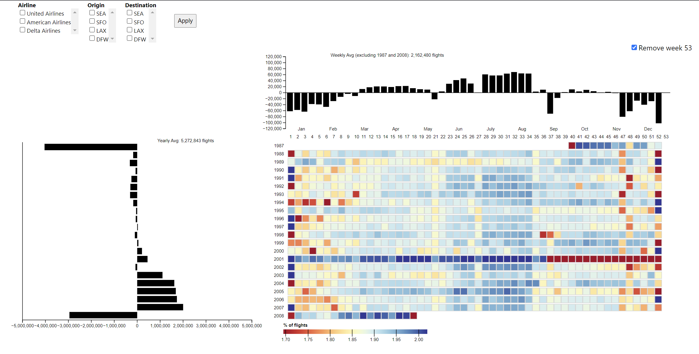

# Data Visualization Project - Aarhus University 2021
<!-- TABLE OF CONTENTS -->
<details>
  <summary>Table of Contents</summary>
  <ol>
    <li>
      <a href="#introduction">Introduction</a>
      <ul>
        <li><a href="#built-with">Built With</a></li>
      </ul>
    </li>
    <li>
      <a href="#getting-started">Getting Started</a>
      <ul>
        <li><a href="#prerequisites">Prerequisites</a></li>
        <li><a href="#installation">Installation</a></li>
      </ul>
    </li>
    <li><a href="#usage">Usage</a></li>
    <li><a href="#known-issues">Known Issues</a></li>
    <li><a href="#contact">Contact</a></li>
  </ol>
</details>


<!-- ABOUT THE PROJECT -->
## Introduction

This is a visualization for the [2009 data expo dataset](https://community.amstat.org/jointscsg-section/dataexpo/dataexpo2009) of Airline on-time performance of flights in USA.
The purpose of this is to find *weekly trends* in number of flights from 1987-2008 and spot weeks in which the number of flights *deviate from an average*.



<p align="right">(<a href="#top">back to top</a>)</p>

### Built With

This project was built with the following frameworks and libraries:

* [Pandas](https://pandas.pydata.org/)
* [Numpy](https://numpy.org/)
* [SQLite](https://www.sqlite.org/index.html)
* [D3](https://d3js.org/)
* [React](https://reactjs.org/)
* [React-d3](https://react-d3-library.github.io/)

<p align="right">(<a href="#top">back to top</a>)</p>


<!-- GETTING STARTED -->
## Getting Started

### Prerequisites

* NodeJS and npm. [Install NodeJS from here](https://nodejs.org/en/download/). After installing NodeJS, install the latest version of Node Package Manager by running: 
  ```sh
  npm install npm@latest -g
  ```
* python 3.x (only if you want to build the aggregated datasets yourself. if not, python is not required)

### Installation

1. Clone the repo
   ```sh
   git clone git@github.com:harith1996/data-viz-au-2021.git
   ```
2. Install packages needed for viz-web-view
   ```sh
   cd viz-web-view
   npm install
   ```
4. Start the web view
   ```js
   npm start
   ```

<p align="right">(<a href="#top">back to top</a>)</p>

<!-- USAGE EXAMPLES -->
## Usage

Refer this [youtube video tutorial](https://youtu.be/WKlim8eWj6I) on how to use the app.

<p align="right">(<a href="#top">back to top</a>)</p>

<!-- KNOWN ISSUES -->
## Known Issues
Filters - Becuase of the size of the dataset, only the following filter combinations have been preprocessed and are currently supported:

American Airlines - SEA - DFW

United Airlines - LAX - SFO

### Get the dataset
If you want to build custom aggregates and analyse the data your own way, you can get the full dataset from [here](http://ww2.amstat.org/sections/graphics/datasets/DataExpo2009.zip).
<!-- CONTACT -->
## Contact

* Nishka Dasgupta - nishka.dasgupta@yahoo.com
* Vidur Singh - vidursingh98@gmail.com
* Harith Rathish - harith1996@gmail.com

<p align="right">(<a href="#top">back to top</a>)</p>
